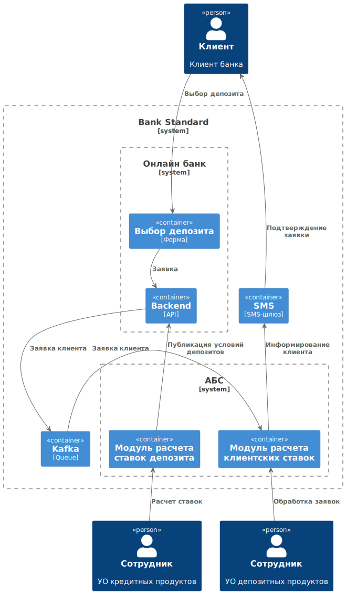

### **Название задачи:** Открытие депозитов онлайн
### **Автор:** Команда цифровой трансформации
### **Дата:** 07.2025
### **Функциональные требования**
Опишите здесь верхнеуровневые Use Cases. Их нужно оформить в виде таблицы с пошаговым описанием:

|**№**|**Действующие лица или системы**|**Use Case**|**Описание**|
| :-: | :- | :- | :- |
| UC1 | - Бэк-офис   - АБС | Расчет и публикация ставок депозиторв | Сотрудник кредитного отдела на основе данных о текущем балансе банка, взятых из АБС, рассчитывает ставки депозитов и публикует их в АБС. | 
| UC2 | - Клиент   - сайт   - SMS-платформа   - АБС| Подача заявки на сайте| Клиент заполняет форму на сайте, указывая ФИО, номер телефона и одну из предложенных ставок депозита. Заявка подтверждается SMS-кодом и отправляется в АБС в статус "Создана" |
| UC3 | - клиент   - call-центр   - АБС| Предложение оформления депозита | АБС подсчитывает черновые индивидуальные предложения и передает заявку в систему call-центра со статусом "Обработка". Сотрудник call-центра звонит клиенту, рассказывает об условиях оформления и назначает визит в банк. По итогам звонка заявка в call-центре переводится в статус "Обработана". | 
| UC4 | - клиент   - front-офис   - АБС   - SMS | Идентификация и подтверждение | Клиент приходит в банк, сотрудник отделения удостоверяет личность клиента в АБС и переводит заявку клиента в статус "Оформление" | 
| UC5 | - бэк-офис   - АБС   - SMS | Оформление депозита | Сотрудник бэк-офиса подтверждает заявку клиента и оформляет депозит. Заявка переводится в статус "Исполнена" |

### **Нефункциональные требования**
Опишите здесь нефункциональные требования и архитектурно значимые требования.

|**№**|**Требование**|
| :-: | :- |
| 1 | Корпоративный стиль |
| 2 | Доступность 99.9 |
| 3 | TLS |
| 4 | Асинхронная связь с АБС |
| 5 | Горизонтальное масштабирование |
| 6 | Распределение в нескольких датацентрах |

### **Решение**

Для ускорения разработки MVP решено по максимуму использовать имеющиеся технологии и продукты. При этом требовалось показать возможности асинхронной архитектуры, несмотря на слабые возможности интеграции АБС и kafka.

1. __kafka__. Интеграция между онлайн-банком и АБС реализована через механизм очередей. В данном решении kafka хранит заявки клиентов из онлайн-банка. Это позволит обеспечить слабую связность двух систем, а также позволит регулировать нагрузку на АБС.

1. __Интернет-банк__ исполнен в виде монолитной системы на стеке .NET Framework MVC/MS SQL. Доработки включают в себя:
   - REST API для работы с депозитами (CRUD)
   - REST API и форму заявки депозитов
   - kafka-producer для отправки заявок в АБС через kafka

1. __АБС__ использует Oracle Database Server и клиент, написанный на Delphi. На этапе MVP для интеграции АБС и онлайн-банка через kafka предлагается использовать Apache Kafka Adapter, импортирующий заявки из очереди в БД.

1. __Модуль расчета ставок депозита__ представляет из себя доработку АБС силами команды банка (PL/SQL + Delphi), заменяющую ручной процесс расчета ставок в Excel. Это позволит сотрудникам бэк-офиса расчитывать и согласовывать ставки в приложении, а также публиковать их в онлайн-банке. 

1. __Модуль расчета клиентских ставок депозита__ представляет из себя доработку АБС силами команды банка (PL/SQL + Delphi), позволяющую сотруднику бэк-офиса обрабатывать заявки клиентов и просчитывать индивидуальные ставки. 

### **Альтернативы**

Очевидно, что текущее решение возникает из-за ограничений имеющейся Автоматизированной Банковской Системы. На каком-то этапе будет целесообразнее модернизировать или заменить ее, решив проблемы масштабирования и простоты внешней интеграции.

Можно реализовать функционал в системе, отдельной от АБС, но, поскольку она сильно связана с последней, потребуется реализовать синхронизацию данных между новой системой и АБС: в АБС должна передаваться информация об открытии счетов, а в новую систему потребуется передавать справочные данные из АБС. К этому прилагается проблема доработки клиентского приложения, где нужно решить вопрос о том, следует ли подключаться к обеим системам из одного приложения или же операторы должны использовать два разных приложения.

**Недостатки, ограничения, риски**

- Предложенный вариант подходит для MVP, но для дальнейшей модернизации нужно реализовать либо механизм синхронизации данных между АБС и новым функционалом, либо API Gateway работы с АБС.
- Итоговый процесс все еще требует ручного участия, может быть улучшен внедрением механизмов автоматического скоринга.
- Процесс зависит от работоспособности нескольких систем, в том числе внедряемого механизма очередей (Kafka).
- требуется дообучение ИТ-персонала работе с новыми системами.
