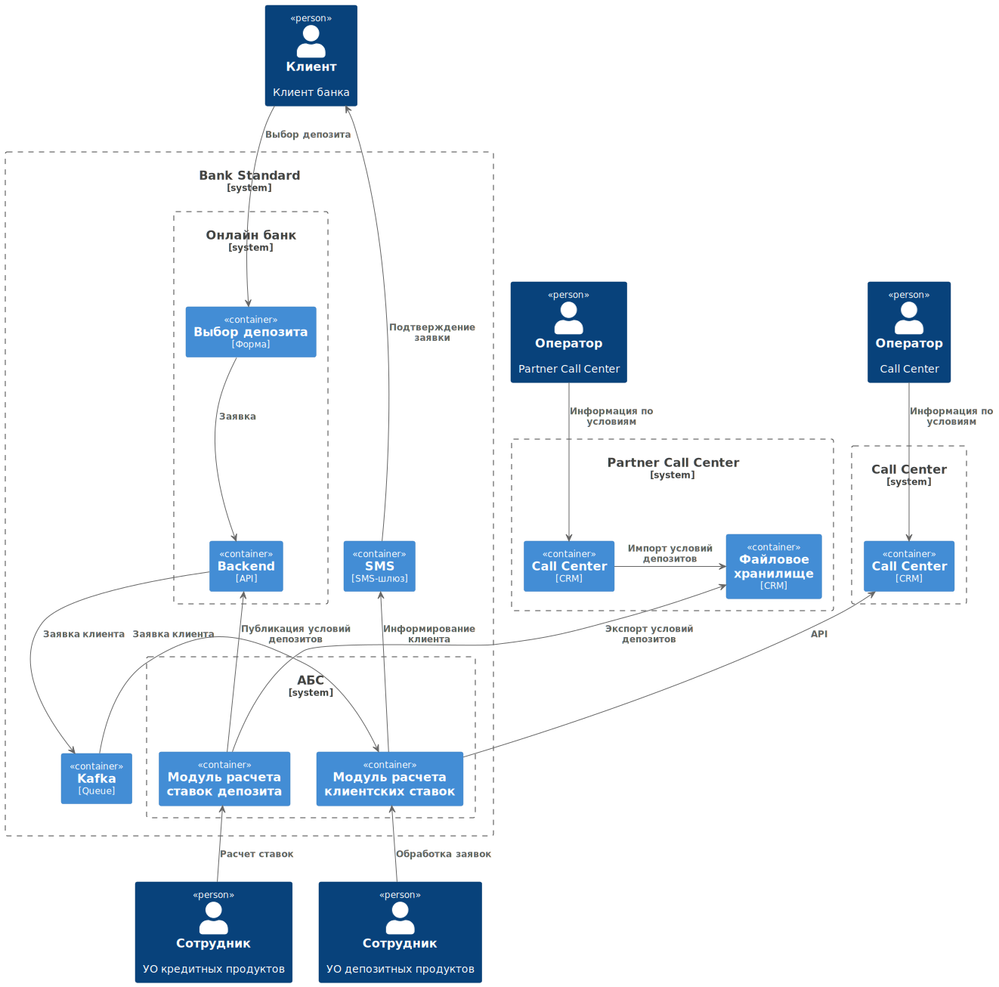

### **Название задачи:** 
### **Автор:**
### **Дата:**
### **Функциональные требования**
Опишите здесь верхнеуровневые Use Cases. Их нужно оформить в виде таблицы с пошаговым описанием:

|**№**|**Действующие лица или системы**|**Use Case**|**Описание**|
| :-: | :- | :- | :- |
| UC1 | - call-центр   оператор call-центра  - АБС  - CRM call-центра | Доступ к условиям ставок для сотрудников call-центра | CRM call-центра имеет доступ по API к подсистеме расчета ставок. Сотрудник call-центра имеет возможность видеть условия депозитов в интерфейсе CRM |
| UC2 | - партнерский call-центр  - файловое хранилище  - оператор партнерского call-центра  - АБС | Доступ к условиям ставок в партнерском CRM | Модуль расчета ставок раз в день экспортирует новые условия в файловое хранилище на стороне партнера. CRM партнера импортирует данные из хранилища в CRM. Сотрудники call-центра видят все условия депозитов в интерфейсе crm и могут консультировать клиентов. |

### **Нефункциональные требования**
Опишите здесь нефункциональные требования и архитектурно значимые требования.

|**№**|**Требование**|
| :-: | :- |
| 1 | Требования безопасности |
| 2 | Ограничения партнерского CRM. Невозможность организовать доступ по API. |

### **Решение**

### **Альтернативы**

Общие условия депозитов являются маркетинговой информацией, не требуют ограничения доступа, и могут быть опубликованы на сайте компании. Если организовать эту информацию в виде knowledge base на сайте, то таким центром информации сможет пользоваться и клиент, и сотрудники обоих call-центров. При этом такая система становится источником правды для всех участников процесса, ссылки можно пересылать клиенту в SMS или указывать в юридически значимых документах. Это повышает значимость сайта как информационной системы, и является логичным шагом при переходе к интернет-банкингу.

**Недостатки, ограничения, риски**

Нет полного контроля за процессом передачи информации в партнерский call-центр, что может привести к значительным финансовым последствиям, если call-центр будет предоставлять устаревшую информацию клиентам.